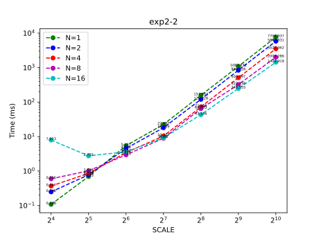

# 并行程序设计实验报告

- SA21011004
- 郭雨轩

## 上机实验1

### 4 

> 比对自己使用`MPI_Send`和`MPI_Recv`实现的`MPI_Alltoall`和`MPI_Allgather`和官方实现的版本之间的性能

可以看到在节点内部通信延时可以忽略不计，但是一旦跨节点就会导致大量的延迟。由于服务器未独占，因此测试的时间不一定准确。

## 上机实验2

### 1

测试了不同规模的LU分解`[256, 512, 1024]`，不同的进程数`[2, 4, 8]`和不同的线程数`[2, 4]`的性能。

| SCALE | NUM_OF_PROCS | OMP_NUM_THREADS | TIME (ms) |
| :---: | :----------: | :-------------: | :-------: |
|  256  |      2       |        2        |  34.391   |
|  256  |      2       |        4        |  27.904   |
|  256  |      4       |        2        |  33.928   |
|  256  |      4       |        4        |  34.148   |
|  256  |      8       |        2        |  33.047   |
|  256  |      8       |        4        |  33.721   |
|  512  |      2       |        2        |  169.948  |
|  512  |      2       |        4        |  128.305  |
|  512  |      4       |        2        |  137.510  |
|  512  |      4       |        4        |  130.587  |
|  512  |      8       |        2        |  134.451  |
|  512  |      8       |        4        |  116.719  |
| 1024  |      2       |        2        |  994.681  |
| 1024  |      2       |        4        |  678.014  |
| 1024  |      4       |        2        |  674.166  |
| 1024  |      4       |        4        |  543.339  |
| 1024  |      8       |        2        |  554.271  |
| 1024  |      8       |        4        |  456.335  |

### 2

测试了不同规模的QR分解`[16, 32, 64, 128, 256, 512, 1024]`和不同线程数`[1, 2, 4, 8, 16]`的性能，如图：

### 3

测试了不同规模的矩阵乘法`[16, 64, 256, 1024]`和不同节点`[4, 16]`的性能，如图：

### 4

我在CPU平台上使用openmp实现了一个`conv2d`算子，针对某一特定形状的卷积算子，在计算节点上测试了其性能如下：

> 形状：N = 8, H = 7, W = 7, KH = 3, KW = 3, CI = 64, CO = 64, SH = 1, SW = 1, PH = 1, PW = 1;

运行时间如图：

