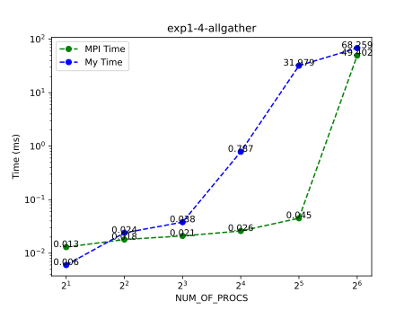
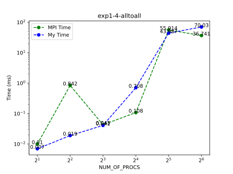
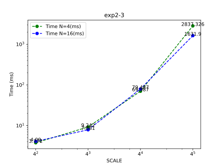
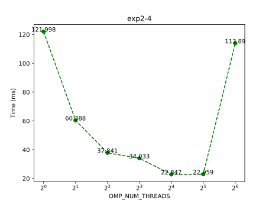

# 并行程序设计实验报告

- SA21011004
- 郭雨轩

## 上机实验1

### 4 

> 比对自己使用`MPI_Send`和`MPI_Recv`实现的`MPI_Alltoall`和`MPI_Allgather`和官方实现的版本之间的性能

可以看到在节点内部通信延时可以忽略不计，但是一旦跨节点就会导致大量的延迟。由于服务器未独占，因此测试的时间不一定准确。当进程过多时，自己实现的Alltoall会出现连接错误。

## 上机实验2

### 1

### 2

测试了不同规模的QR分解`[16, 32, 64, 128, 256, 512, 1024]`和不同线程数`[4, 8, 16]`的性能，如图：

### 3

测试了不同规模的矩阵乘法`[16, 64, 256, 1024]`和不同节点`[4, 16]`的性能，如图：

### 4

我在CPU平台上使用openmp实现了一个`conv2d`算子，针对某一特定形状的卷积算子，在计算节点上测试了其性能如下：

> 形状：N = 8, H = 7, W = 7, KH = 3, KW = 3, CI = 64, CO = 64, SH = 1, SW = 1, PH = 1, PW = 1;

运行时间如图：

